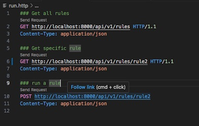

# Email Filtering Rules

This project is writing filtering rules for email manipulation. Emails are already stored under mysqldb. This application provides end-user with ability to read, add rules which are finally saved on disc as json file. based on these rules actions are taken on emails stored in mysqldb.

## Table of Contents

- [Installation](#installation)
- [Pre-requisites for Usage](#Prerequisites)
- [Mysql DB Schema](#mysqlSchema)
- [Usage](#usage)
- [Limitations and Enhancements](#limitations)

## Installation

Instructions on how to install and set up the project.

```bash
# Example command
git clone git@github.com:<username>/emailfilteringrules.git
cd repo
pip install -r requirements.txt
```

## Pre-requisites for Usage

This assumes you have setup:
1. mysql should already be setup with emails stored under db. The schema of mysql db is already shared below. For now I have hardcoded database to credentials and table name to mailbox.
2. setup env variables for mysql user, password and database
```bash
$ export SQLUSER=<user>
$ export SQLPASS=<password>
$ export DATABASE=<database name>
```

## Mysql DB Schema

Below is db schema required for project setup:


## Usage

Once env variables have been set run the server using below command:

1. ```bash
$ uvicorn applyRules:app --reload
```

2. Run the apis from run.http file included in the project by clicking on 'Send Request'




### Limitations and Enhancements

1. Adding new rules using api
2. Adding proper exception handling in progress
3. Adding test cases